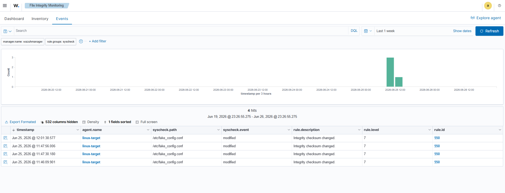
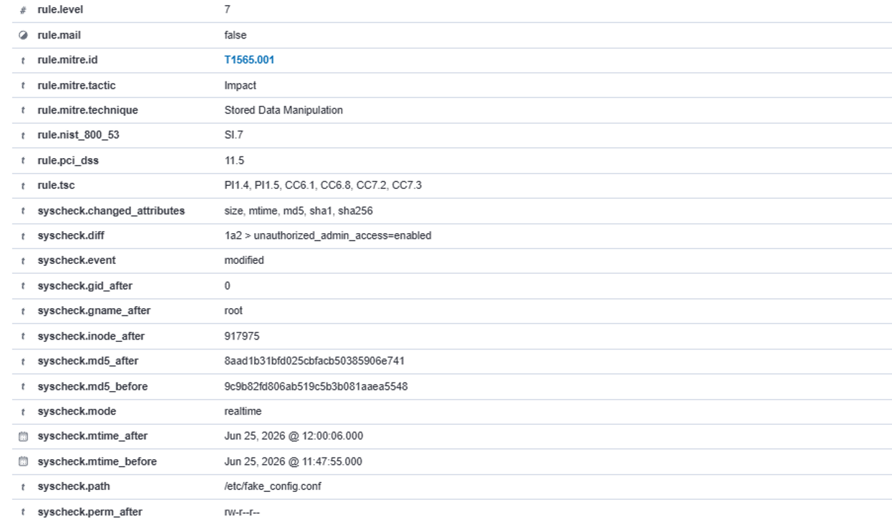
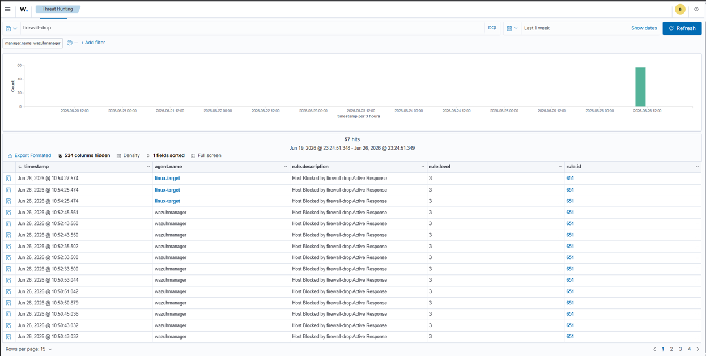

# wazuh-active-defense-lab
Automated SIEM telemetry, real-time file integrity monitoring, and active response firewall drops using Wazuh

# Open-Source SIEM & Active Response Engineering Lab (Wazuh)

An end-to-end Purple Team deployment demonstrating centralized log aggregation, real-time File Integrity Monitoring (FIM), and automated Active Response threat mitigation using an open-source SIEM (Wazuh) ecosystem.

## 🏗️ Architecture Overview
The environment consists of a decentralized architecture hosted on Oracle VirtualBox:
* **Wazuh Manager Server:** Distributed on Ubuntu Server, serving as the central log correlation engine, decoder repository, and active-response conductor.
* **Linux Target Endpoint (linux-target):** Monitored Ubuntu node running the Wazuh Agent with active telemetry forwarding hooks into kernel space.

---

## 🛠️ Project Phases & Implementation Details

### Phase 1: Security Configuration Assessment (SCA Compliance)
* Configured automated system hardening audits against Center for Internet Security (CIS) benchmarks.
* Analyzed target configuration vulnerabilities, tracking critical flaws like unnecessary open ports and missing OS patches.

### Phase 2: Real-Time File Integrity Monitoring (FIM) with Content Diffs
* Transitioned the FIM subsystem (`syscheck`) from passive interval scheduling to **active real-time kernel monitoring** utilizing Linux `inotify`.
* Modified system XML definitions to enable `report_changes="yes"`, forcing the agent to securely cache text changes and ship line-by-line file modifications (`syscheck.diff`) to the central console during simulated file tampering incidents.

### Phase 3: Automated Active Response (Brute-Force Mitigation)
* Engineered a live digital tripwire directly in the server registry (`ossec.conf`).
* Developed a dynamic, tiered defense system utilizing severity threshold levels to monitor system telemetry waterfalls (PAM, local `su` authentication, and `unix_chkpwd`).
* Configured the system to invoke local script execution (`firewall-drop`), dynamically blocking adversarial IP addresses via system firewalls (`iptables`) for 180 seconds when brute-force thresholds are breached.

---

## 📊 Proof of Concept & Forensic Artifacts
## 📊 Proof of Concept & Forensic Artifacts

### 1. Real-Time FIM Alert Triggered

This screenshot displays the Wazuh dashboard capturing real-time File Integrity Monitoring (FIM) telemetry from the `linux-target` agent node. When a critical configuration file (`/etc/fake_config.conf`) was modified, the agent immediately detected the change via kernel space monitoring loops and generated a **Level 7 Security Alert (Rule 550: Integrity checksum changed)**.

---

### 2. Forensic File Content Diff Collected

Expanding the alert metadata reveals the precise cryptographic and forensic changes captured by the system. The **`syscheck.diff`** field isolates the exact malicious payload injected into the system: `+unauthorized_admin_access=enabled`. This demonstrates Wazuh's capability to track not just *that* a file was altered, but to preserve a line-by-line historic diff for post-incident forensic investigations, mapping directly to **MITRE ATT&CK T1565.001 (Stored Data Manipulation)**.

---

### 3. Active Response Firewall Block Fired

The final phase of the Purple Team lab demonstrates automated active defense. Upon detecting repeated unauthorized access attempts, the Wazuh Manager dynamically invoked the **`firewall-drop` Active Response script (Rule 651)** on the target machine. The telemetry graph showcases the spike in defensive actions as the manager immediately blocked the offending attacker IP address, neutralizing the threat automatically without human intervention.
---

## 🚀 Key Takeaways & Skills Demonstrated
* **SIEM Tuning & Log Analysis:** Deep understanding of system log waterfalls (PAM frameworks, SSHD decoders, custom rule matching).
* **XML Infrastructure-as-Code:** Configuring enterprise-grade security policies while maintaining strict syntax formatting constraints.
* **Purple Teaming Operations:** Combining defensive engineering (Blue) with automated countermeasures to dynamically neutralize adversary attack scripts (Red).
